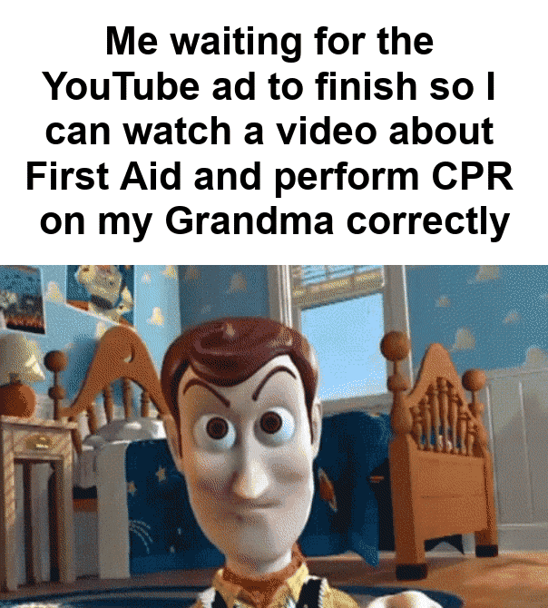
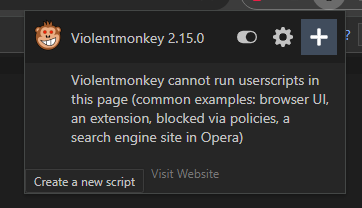
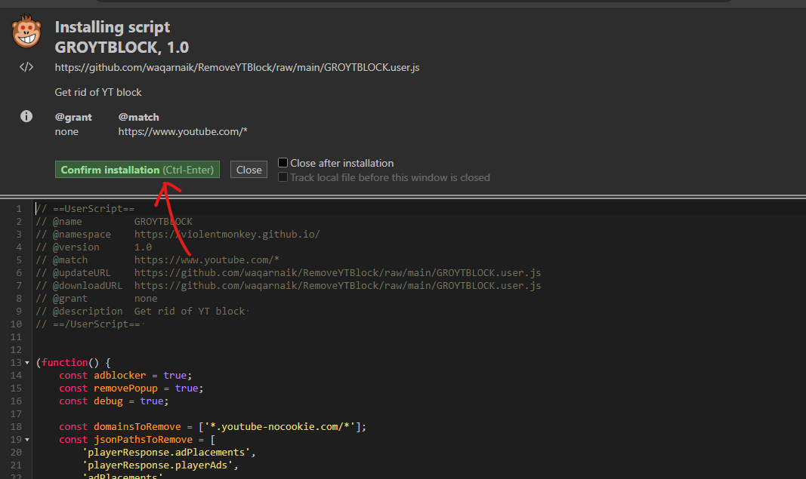
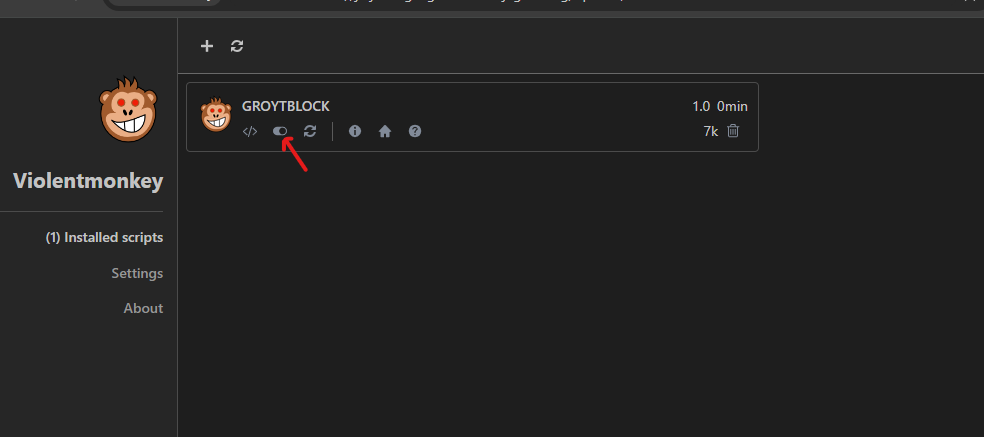

# Since Ad blocker are not allowed on YouTube - <br>How to get rid of YTBlock?



## Introduction

>Starting is a breeze; just follow the simple instructions provided below. And, we've got a nifty trick up our sleeves to help you skip ads, a powerful userscript tailored to eliminate the pesky "Ad blockers are not allowed on YouTube" popup. To begin, follow the straightforward instructions below. 

## Steps to AdFree YT Heaven

1. **Install Voilentmonkey extension as per your browser**:<br>
   You can find it here as per your browser: [Install VoilentMonkey Extension](https://violentmonkey.github.io/)

2. **Open Voilentmonkey Dashboard**:<br>
   Click on the extension icon in your browser and select Add "+" button or create new.<br><br>


4. **Enable the Script & Enjoy :)**:<br>
[Click Here to Automaitcally Install](https://github.com/waqarnaik/RemoveYTBlock/raw/main/GROYTBLOCK.user.js).
or [copy script from here >](https://github.com/waqarnaik/RemoveYTBlock/blob/main/GROYTBLOCK.js)<br><br>


## Important Notes

✔️ **Script always Enabled**:<br>
   Make sure in Extension Voilentmonkey Dashboard Script always turned or toggled to Enabled state.<br><br>
   

✔️ **Disable AdBlocker**:<br>
```diff
- DISABLE ALL THE THIRDPARTY ADBLOCKERS YOU ARE USING TO BLOCK ADS ON YOUTUBE. 
```
No worries this script will removes ads in snap on YT.

--- --- --- --- --- --- --- --- --- --- --- --- --- --- --- ---

## Tribute To Contributors: (Git peoples who contributed to create this scripts)

- [AngelPuzzle](https://github.com/angelapuzzle)
- [oSumAtrIX](https://github.com/oSumAtrIX)
- [Albedo-13](https://github.com/Albedo-13)
- [SleepingPig35](https://github.com/SleepingPig35)
- [marjansimic](https://github.com/marjansimic)
- [Pecunia201](https://github.com/Pecunia201)
- [henryli17](https://github.com/henryli17)
- [ClientNode](https://github.com/ClientNode)
- [androgouws911](https://github.com/androgouws911)
